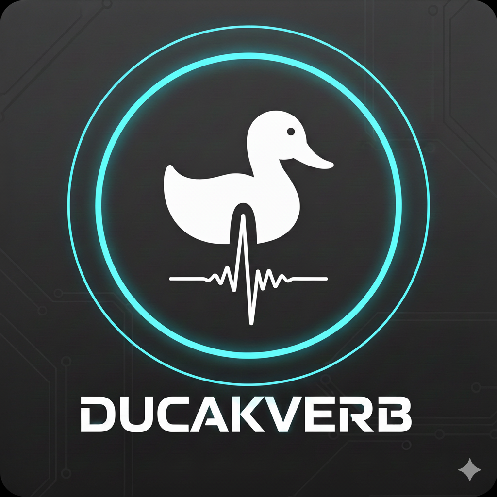

# Duckaverb VST

[](https://github.com/zeztto/duckaverb-vst/actions)

<p align="center">
  
</p>

**Duckaverb**는 일렉트릭 기타를 위해 설계된 **원노브(One-Knob) 덕킹 리버브** VST 플러그인입니다.

h4ppy Labs의 두 번째 제품으로, 연주 중에는 명료함을 유지하고 연주가 멈추면 풍부한 공간감을 제공하는 "덕킹(Ducking)" 효과를 하나의 노브로 간편하게 제어할 수 있습니다.

## 주요 기능

-   **One-Knob "Space" Control**: 하나의 노브로 리버브의 믹스, 길이(Decay), 댐핑, 그리고 덕킹 감도를 동시에 조절합니다.
    -   **0%**: 드라이(Dry)한 사운드
    -   **50%**: 자연스러운 리버브와 부드러운 덕킹
    -   **100%**: 거대한 앰비언트 사운드와 강력한 덕킹 효과
-   **Ducking Reverb**: 입력 신호(기타 연주)가 들어올 때 리버브 레벨을 자동으로 낮춰, 빠른 연주나 리드 톤에서도 노트가 뭉개지지 않습니다
-   **Pedal-Style UI**: FUZZA VST에서 영감을 받은 기타 페달 스타일의 직관적인 인터페이스
    -   컴팩트한 단일 노브 디자인
    -   명확한 BYPASS 풋스위치
    -   다크 테마와 오렌지 악센트
-   **Custom Icon**: 오리와 오디오 파형이 결합된 독특한 앱 아이콘
-   **Multi-Platform**: macOS (VST3, AU, Standalone), Windows (VST3, Standalone) 지원
-   **CI/CD**: GitHub Actions를 통한 자동 빌드

## 설치 및 빌드 방법

이 프로젝트는 **JUCE** 프레임워크와 **CMake**를 사용합니다.

### 필수 요구 사항
-   **CMake** (3.15 이상)
-   **C++ 컴파일러** (macOS: Xcode / Windows: Visual Studio 2019 이상)
-   **Git**

### 빌드하기

1.  **리포지토리 클론**:
    ```bash
    git clone https://github.com/zeztto/duckaverb-vst.git
    cd duckaverb-vst
    ```

2.  **CMake 구성**:
    ```bash
    cmake -B build
    ```

3.  **빌드**:
    -   **macOS**:
        ```bash
        cmake --build build --config Release
        ```
    -   **Windows**:
        ```cmd
        cmake -B build -G "Visual Studio 17 2022" -A x64
        cmake --build build --config Release
        ```

4.  **설치 확인**:
    -   빌드된 플러그인은 `build/Duckaverb_artefacts/Release/` 또는 시스템 플러그인 폴더에 위치합니다
    -   **macOS**:
        -   AU: `~/Library/Audio/Plug-Ins/Components/Duckaverb.component`
        -   VST3: `~/Library/Audio/Plug-Ins/VST3/Duckaverb.vst3`
        -   Standalone: `build/Duckaverb_artefacts/Release/Standalone/Duckaverb.app`
    -   **Windows**:
        -   VST3: `C:\Program Files\Common Files\VST3\Duckaverb.vst3`
        -   Standalone: `build\Duckaverb_artefacts\Release\Standalone\Duckaverb.exe`

## 기술 스택

-   **Framework**: JUCE 8.0.4
-   **Build System**: CMake 3.15+
-   **Language**: C++17
-   **Platforms**: macOS 10.13+, Windows 10+

## 문서

-   [개발 가이드](DOCS/DEVELOPMENT.md)
-   [UI 디자인 가이드](DOCS/UI_DESIGN.md)
-   [Windows 설치 가이드](DOCS/WINDOWS_INSTALL.md)
-   [변경 로그](CHANGELOG.md)

## 라이선스

이 프로젝트는 오픈 소스입니다. (라이선스 명시 필요 시 추가)

## 제작

**h4ppy Labs**
-   Developed by: Antigravity & Contributors
-   Reference: [fuzza-vst](https://github.com/zeztto/fuzza-vst)

---

© 2025 h4ppy Labs. All rights reserved.
